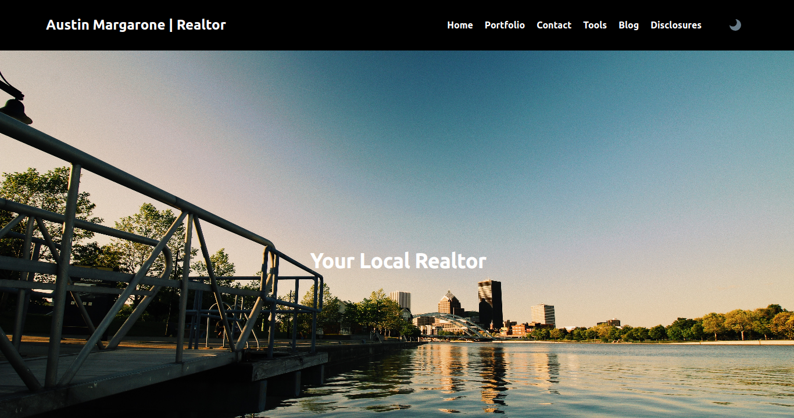

# Vacation Rental

[](LICENSE)



## Description

Vacation Rental

## Table of Contents

- [Demo](#demo)
- [Technologies Used](#technologies-used)
- [Features](#features)
- [Installation](#installation)
- [Usage](#usage)
- [Contributing](#contributing)
- [License](#license)
- [Acknowledgments](#acknowledgments)
- [Contact](#contact)

## Demo

Check out the live website [here](https://austinmargaronerealestate.com/).

## Technologies Used

My Real Estate Portfolio is built using the following technologies:

- HTML
- TailwindCSS
- Git & GitHub
- NextJS
- Sanity
- TypeScript

## Features

- See previous transactions and reviews.
- Get information on the local real estate market.
- Access tools like mortgage calculator and market charts.

## Installation

To set up the project locally, follow these steps:

1. Clone this repository to your local machine:

   ```bash
   git clone github.com/austinmargarone/realtor.git
   ```

2. Navigate to the project directory:

   ```bash
   cd realtor
   ```

3. Install the necessary dependencies:

   ```bash
   npm install
   ```

4. Start the development server:

   ```bash
   npm start
   ```

## Usage

Explore what the applicatoin has to offer!

## Contributing

We welcome contributions from the community! To contribute to the project, follow these steps:

1. Fork this repository.
2. Create a new branch (`git checkout -b feature/your-feature-name`).
3. Make your changes and commit them (`git commit -am 'Add new feature'`).
4. Push to the branch (`git push origin feature/your-feature-name`).
5. Create a new Pull Request.

Please review our [Contributing Guidelines](CONTRIBUTING.md) for more details.

## License

This project is licensed under the [MIT License](LICENSE).

## Contact
